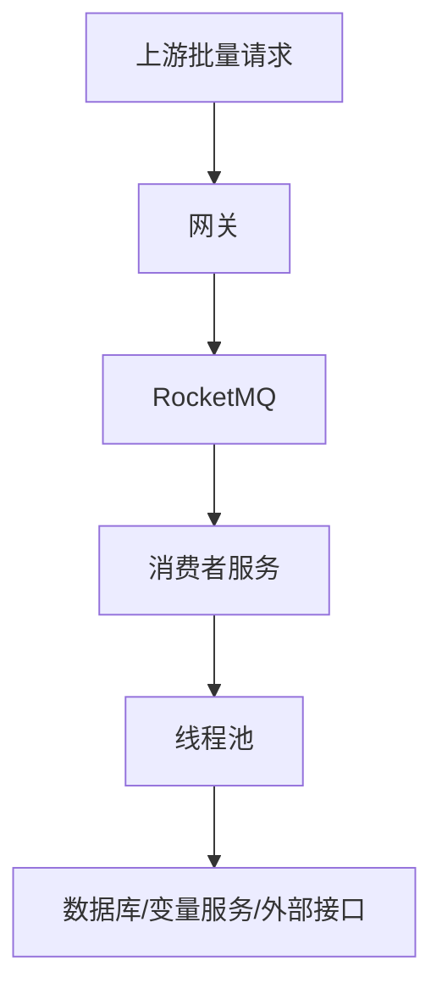
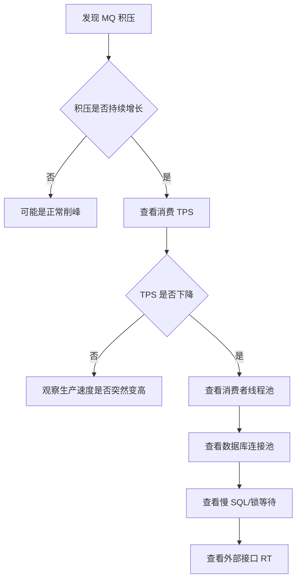

# 第二章 MQ 为什么成为整个架构的核心

## 2.1 问题：为什么引入 MQ？

批量系统需要解决两个核心矛盾：

### 矛盾一：生产速度和消费速度不一致

上游可能在短时间内提交大量请求。

但是消费者处理任务需要时间：

- 查询数据库
- 查询变量中心
- 调用外部接口
- 执行业务规则
- 写入结果表

如果生产端直接调用消费端，下游会被瞬时流量打爆。

---

### 矛盾二：实时链路和批量链路应该解耦

实时链路应该快速完成请求接收和任务投递。

批量处理不应该阻塞实时审批链路。

MQ 的价值就是：

> 让生产端和消费端在时间上解耦，在处理能力上解耦。

---

## 2.2 为什么不是 HTTP 异步？

HTTP 异步只能解决：

> 调用方不用一直等待结果。

但它无法很好解决：

- 流量缓冲
- 消息持久化
- 失败重试
- 消费端按能力慢慢处理
- 消费端横向扩容
- 生产速度与消费速度不匹配

HTTP 异步本质上仍然是请求直接打到下游服务。

如果下游服务处理不过来，压力仍然会传导到服务本身。

---

## 2.3 MQ 解决的不是“异步”，而是“削峰和解耦”

MQ 的核心能力：

| 能力 | 作用 |
|---|---|
| 异步 | 上游快速返回，不等待下游处理完成 |
| 削峰 | 请求先堆积在 MQ 中，消费者按能力消费 |
| 解耦 | 生产者不依赖消费者具体实现 |
| 持久化 | 消息不会因为消费者暂时不可用而立即丢失 |
| 重试 | 消费失败后可以重新投递 |
| 扩容 | 消费者可以水平扩展 |

一句话：

> HTTP 异步解决“调用方不等待”，MQ 解决“生产和消费能力不匹配”。

---

## 2.4 MQ 削峰的链路

当上游瞬时提交大量任务时：

- 请求先进入 MQ
- 消费者按线程池和数据库连接池能力消费
- 消费不过来时，消息留在 MQ 中
- 系统不会把压力一次性压到数据库

---

## 2.5 MQ 积压是否一定是异常？

不一定。

要区分两种情况：

### 正常削峰

特征：

- 短时间积压上升
- 消费 TPS 稳定
- 消费成功率正常
- 重试次数没有明显增加
- 数据库和外部接口 RT 正常

这种情况说明 MQ 正在发挥缓冲作用。

---

### 系统异常

特征：

- 积压持续增长
- 消费 TPS 下降
- 消费失败率上升
- 重试次数增加
- 线程池活跃线程数打满
- 数据库连接池耗尽
- 慢 SQL 增多
- 外部接口 RT 变长

---

## 2.6 MQ 积压排查路径

排查指标：

- MQ 积压量
- 消费 TPS
- 消费成功率
- 消息重试次数
- 线程池活跃线程数
- 线程池队列长度
- 数据库连接池使用率
- SQL RT
- 外部接口 RT

---

## 2.7 延伸问题

MQ 解耦之后，消费者服务内部仍然要处理并发。

于是引出下一章：

> 消费者为什么需要线程池？  
> 线程池如何设计？  
> 为什么线程池不能无限大？

---
