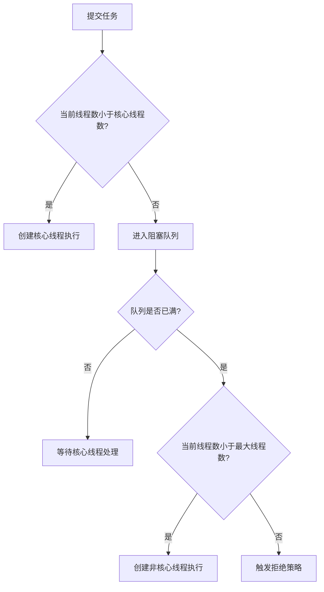

# 第三章 线程池为什么决定系统吞吐量

## 3.1 问题：消费者为什么不直接处理？

MQ 消费者拿到消息后，可以直接执行业务逻辑。

但如果每条消息都串行处理，吞吐量会很低。

批量决策任务通常包括：

- 查询数据库
- 查询变量中心
- 调用外部接口
- 执行规则计算
- 写入结果

这些操作属于典型 IO 密集型任务。

因此，消费者通常会配合线程池处理任务，提高并发能力。

---

## 3.2 为什么不用 new Thread？

直接 new Thread 存在几个问题：

- 线程创建销毁成本高
- 无法统一控制并发数
- 容易创建过多线程导致内存和调度开销上升
- 无法统一命名、监控和治理

线程池的价值：

> 复用线程、限制并发、控制队列、提供拒绝策略。

---

## 3.3 ThreadPoolExecutor 七个参数

```java
new ThreadPoolExecutor(
    int corePoolSize,
    int maximumPoolSize,
    long keepAliveTime,
    TimeUnit unit,
    BlockingQueue<Runnable> workQueue,
    ThreadFactory threadFactory,
    RejectedExecutionHandler handler
)
```

### corePoolSize

核心线程数。

正常情况下维持的基础处理能力。

---

### maximumPoolSize

最大线程数。

用于应对短时高峰。

---

### keepAliveTime + unit

非核心线程空闲多久后销毁。

高峰结束后，线程池可以回落到核心线程数。

---

### workQueue

任务队列。

推荐使用有界队列，例如：

- ArrayBlockingQueue

不建议使用无界队列，因为任务积压过多可能 OOM。

---

### ThreadFactory

线程工厂。

主要用于：

- 设置线程名称
- 设置异常处理
- 方便日志和监控排查

---

### RejectedExecutionHandler

拒绝策略。

常见策略：

- AbortPolicy：抛异常
- CallerRunsPolicy：调用线程自己执行
- DiscardPolicy：直接丢弃
- DiscardOldestPolicy：丢弃最旧任务

在 MQ 消费场景中，通常更倾向于：

> AbortPolicy + MQ 重试机制

而不是让线程池无限制堆积任务。

---

## 3.4 为什么线程池先入队，再扩容？

线程池执行流程：



这样设计的核心是：

> 优先复用已有线程，避免轻易创建大量线程。

如果核心线程一满就创建到最大线程数，会造成：

- 线程数快速膨胀
- 上下文切换增加
- 内存占用增加
- 系统稳定性下降

---

## 3.5 为什么 IO 密集型线程数可以大于 CPU 核数？

IO 密集型任务大部分时间在等待：

- 数据库
- RPC
- Redis
- MQ
- 第三方接口

线程等待 IO 时，CPU 可能空闲。

适当增加线程数可以提高 CPU 利用率。

但线程数不能无限增加。

因为瓶颈通常不是 CPU，而是：

- 数据库连接池
- 外部接口吞吐
- RPC 服务处理能力
- 下游系统 RT

---

## 3.6 为什么线程池不能脱离数据库连接池设计？

例如：

- 线程池最大线程数：200
- 数据库连接池：50

同一时间最多只有 50 个线程能拿到数据库连接。

剩下 150 个线程会阻塞等待连接。

后果：

- 线程占用 JVM 内存
- 上下文切换增加
- 线程池活跃线程数长期高位
- 新任务无法及时处理
- MQ 消费 TPS 下降
- 消息积压增加

所以线程池大小必须结合：

- 数据库连接池大小
- SQL RT
- 外部接口 RT
- 机器 CPU
- 压测结果

综合确定。

---

## 3.7 延伸问题

当线程池和数据库连接池都已经合理设计后，如果数据库仍然慢，就需要进入下一层：

> SQL 为什么慢？  
> 索引为什么失效？  
> 数据库连接为什么长时间不释放？

---
