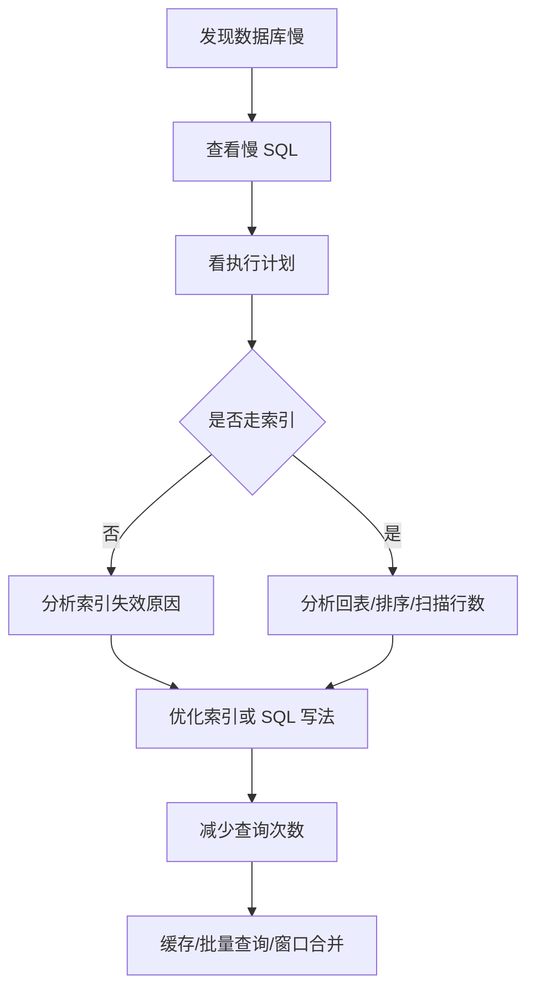
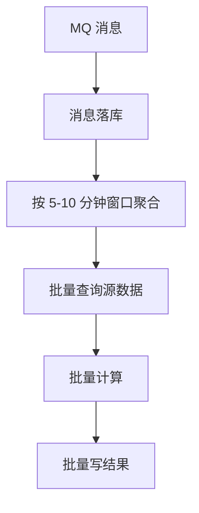

# 第四章 数据库为什么成为性能瓶颈

## 4.1 问题：数据库为什么容易成为瓶颈？

在批量决策系统中，数据库承载大量查询和写入。

常见场景：

- 查询客户数据
- 查询历史申请记录
- 查询变量数据
- 查询营销结果
- 写入任务状态
- 写入决策结果
- 记录消息状态

数据库瓶颈常见表现：

- SQL RT 增加
- 数据库连接池耗尽
- 慢 SQL 增多
- 锁等待
- CPU 或 IO 飙高
- MQ 消费 TPS 下降

---

## 4.2 优化顺序

数据库优化不要一上来就加机器，也不要盲目加索引。

推荐顺序：



---

## 4.3 为什么加了索引还是不走？

常见原因：

### 1. 不符合最左前缀

联合索引：

```text
(user_id, status, create_time)
```

查询：

```sql
where user_id = ?
  and create_time between ? and ?
```

中间缺少 `status` 条件。

索引只能稳定利用 `user_id`，不能跳过 `status` 充分利用 `create_time`。

---

### 2. 索引列被函数处理

```sql
where date(create_time) = '2026-07-01'
```

应改为：

```sql
where create_time >= '2026-07-01'
  and create_time < '2026-07-02'
```

---

### 3. 隐式类型转换

字段是 varchar，但查询写数字：

```sql
where phone = 13800138000
```

可能导致索引失效。

---

### 4. like 前置通配符

```sql
where name like '%abc'
```

B+Tree 索引通常无法有效利用。

---

### 5. 区分度太低

例如：

- status
- gender
- flag

如果字段取值很少，优化器可能认为全表扫描更划算。

---

### 6. 返回数据量太大

即使有索引，如果命中大量数据，优化器也可能选择全表扫描。

---

### 7. 回表成本过高

查询字段很多：

```sql
select *
```

即使二级索引命中，也需要大量回表。

这时可以考虑：

- 减少返回字段
- 覆盖索引
- 分阶段查询

---

## 4.4 联合索引问题链

### 问题1

索引：

```text
(user_id, status, create_time)
```

SQL：

```sql
select *
from decision_task
where user_id = ?
  and create_time between ? and ?
order by create_time desc;
```

能否充分利用索引？

答案：

不能充分利用。

原因：

- `user_id` 可以利用
- 中间的 `status` 缺失
- 不能跳过 `status` 去充分利用 `create_time`
- 可能需要额外排序

---

### 问题2

SQL：

```sql
select *
from decision_task
where user_id = ?
  and status = ?
  and create_time between ? and ?
order by create_time desc;
```

能否充分利用索引？

答案：

可以。

原因：

- `user_id` 是等值条件
- `status` 是等值条件
- `create_time` 可以做范围扫描
- `order by create_time desc` 可以通过反向扫描索引完成

---

### 问题3

SQL：

```sql
select *
from decision_task
where user_id = ?
  and status = ?
  and create_time between ? and ?
order by update_time desc;
```

能否充分利用索引？

答案：

只能部分利用。

原因：

- where 条件可以利用 `(user_id, status, create_time)`
- 但 `order by update_time desc` 不在索引顺序中
- 可能需要额外 filesort

---

## 4.5 深分页为什么慢？

传统分页：

```sql
select *
from decision_task
order by id
limit 100000, 100;
```

数据库需要先扫描前 100000 行，再返回 100 行。

优化方式：

使用 Seek Pagination：

```sql
select *
from decision_task
where id > ?
order by id
limit 100;
```

或者基于时间：

```sql
select *
from decision_task
where create_time > ?
order by create_time
limit 100;
```

核心思想：

> 不让数据库跳过大量无用记录。

---

## 4.6 数据库成为瓶颈时如何优化？

可以从两个目标入手：

### 目标一：缩短每次连接占用时间

方式：

- 优化慢 SQL
- 减少扫描行数
- 减少回表
- 优化排序
- 避免锁等待
- 避免深分页

---

### 目标二：减少访问数据库的总次数

方式：

- Redis 缓存热点数据
- 批量查询
- 本地批次缓存
- MQ 时间窗口合并
- 预聚合
- 汇总表
- 离线计算

---

## 4.7 MQ 与数据库优化结合

如果每条 MQ 消息都查一次数据库，会造成大量重复 IO。

优化思路：

- 消息先落库，便于审计和幂等
- 按时间窗口合并同类任务
- 对同一个窗口内的消息统一查询源数据
- 批量计算结果
- 批量写入

例如：



---
