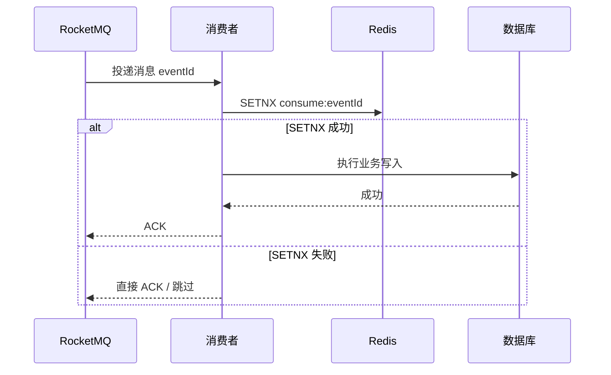

# 第五章 Redis 在系统中的定位

## 5.1 从数据库瓶颈引出 Redis

在第四章中，我们已经看到数据库容易成为系统瓶颈。

在批量决策系统中，消费者处理每条 MQ 消息时，可能需要访问：

- 客户基础信息
- 产品配置
- 决策规则配置
- 外部变量结果
- 历史申请记录
- 任务状态
- 消息状态

如果每条消息都直接访问数据库，数据库连接池、SQL RT、慢查询都会成为吞吐瓶颈。

因此自然引出一个问题：

> 能不能把一部分高频读取的数据放到 Redis，减少数据库访问？

Redis 的核心定位不是替代数据库，而是：

> 缓解数据库读压力，提高热点数据访问速度。

---

## 5.2 Redis 适合解决什么问题？

Redis 适合解决以下几类问题：

### 1. 热点数据读取

例如：

- 产品配置
- 风控规则配置
- 字典表
- 外部接口返回的短期有效结果
- 批量任务运行状态

这些数据：

- 读取频繁
- 修改较少
- 对实时一致性要求相对可控

适合放入 Redis。

---

### 2. 幂等去重

在 MQ 消费场景中，消息可能重复投递。

可以通过 Redis `SETNX` 做快速去重：

```text
SETNX consume:eventId 1 EX 3600
```

如果返回成功，说明首次处理。

如果返回失败，说明已经处理过或正在处理。

---

### 3. 分布式锁

对于同一个 `taskId`、`requestId`、`eventId` 的并发处理，可以使用 Redis 分布式锁防止并发重复执行。

例如：

```text
lock:decision:task:{taskId}
```

---

### 4. 短期状态缓存

例如 OCR 轮询场景：

- 请求已提交
- OCR 处理中
- OCR 成功
- OCR 失败
- 任务超时

这些状态可以短时间放 Redis，降低数据库写入压力。

---

## 5.3 Redis 为什么快？

Redis 快的原因主要包括：

1. 基于内存操作
2. 单线程执行命令，减少线程切换和锁竞争
3. IO 多路复用
4. 高效数据结构
5. 命令执行逻辑简单

需要注意：

> Redis 单线程指的是命令执行主线程模型，并不是 Redis 整个进程只有一个线程。

---

## 5.4 为什么不能把所有数据都放 Redis？

Redis 不是数据库的替代品。

主要原因：

### 1. 内存成本高

Redis 数据放内存，成本高于数据库磁盘存储。

---

### 2. 持久化能力不是它的核心定位

Redis 支持 RDB、AOF，但它更适合缓存和高速访问，不适合作为所有核心业务数据的唯一存储。

---

### 3. 一致性问题

数据库和 Redis 是两个系统。

一旦数据同时存在两份，就会有缓存一致性问题。

---

### 4. 数据模型不适合复杂查询

Redis 适合 Key-Value、Hash、Set、ZSet 等结构。

不适合复杂 Join、复杂报表、强事务查询。

---

## 5.5 缓存穿透

### 问题

请求查询一个数据库中不存在的数据。

如果每次都穿透 Redis 去查数据库，会造成数据库压力。

例如：

```text
查询 customerId = 999999999
Redis 没有
数据库也没有
下次继续查数据库
```

---

### 解决方案

1. 缓存空值

```text
customer:999999999 -> NULL
TTL 5分钟
```

2. 布隆过滤器

提前判断某个 key 是否可能存在。

如果布隆过滤器判断不存在，直接拦截，不访问数据库。

---

## 5.6 缓存击穿

### 问题

某个热点 key 过期瞬间，大量请求同时访问数据库。

例如：

```text
product:rule:1001 过期
1000 个请求同时进来
全部查数据库
```

---

### 解决方案

1. 互斥锁

只有一个线程去查数据库并回填缓存，其他线程等待或返回旧值。

2. 热点 key 永不过期

逻辑过期，不设置物理过期时间。

3. 提前刷新缓存

定时任务在过期前主动刷新热点 key。

---

## 5.7 缓存雪崩

### 问题

大量 key 同一时间过期，或者 Redis 整体不可用，导致请求全部打到数据库。

---

### 解决方案

1. TTL 加随机值

避免大量 key 同时过期：

```text
TTL = 30分钟 + 随机 0~5分钟
```

2. 多级缓存

本地缓存 + Redis + 数据库。

3. 限流降级

Redis 异常时限制访问数据库的流量。

4. Redis 高可用

哨兵、集群、主从复制。

---

## 5.8 缓存一致性问题

### 问题

数据库和 Redis 同时存储一份数据时，更新顺序会影响一致性。

常见错误做法：

```text
先更新缓存，再更新数据库
```

如果数据库更新失败，缓存中就是脏数据。

---

## 5.9 常见更新策略

### 方案一：先更新数据库，再删除缓存

推荐常用方案：

```text
更新数据库
↓
删除缓存
```

下次查询：

```text
缓存未命中
↓
查询数据库
↓
回填缓存
```

优点：

- 实现简单
- 不容易产生长期脏数据

---

### 方案二：延迟双删

用于降低并发读写导致脏数据的概率。

流程：

```text
删除缓存
↓
更新数据库
↓
延迟一段时间
↓
再次删除缓存
```

---

### 方案三：异步订阅数据库变更

例如通过：

- Binlog
- Canal
- 消息队列

同步更新或删除缓存。

适合更复杂、更高一致性要求的场景。

---

## 5.10 Redis 和 MQ 幂等结合

在 MQ 消费中，Redis 可用于快速去重。

流程：



注意：

Redis 去重不能完全替代数据库幂等。

因为 Redis 可能过期、丢失或不可用。

更稳妥的设计是：

> Redis 快速去重 + 数据库唯一索引兜底。

---

## 5.11 Redis 分布式锁

### 使用场景

当多个消费者可能同时处理同一个任务时，需要锁住任务。

例如：

```text
lock:task:{taskId}
```

---

### 基本原则

1. 加锁必须设置过期时间
2. 解锁必须校验持有者身份
3. 锁粒度不能过大
4. 加锁失败要有降级逻辑
5. 业务执行时间不能超过锁过期时间太多

---

### 为什么不能简单 setnx 后 delete？

如果线程 A 加锁成功，但业务执行时间过长，锁过期。

线程 B 加锁成功。

此时线程 A 执行结束后 delete，可能误删线程 B 的锁。

正确做法：

- value 设置唯一 token
- 删除时校验 token

---

## 5.12 Redisson 的价值

Redisson 对 Redis 分布式锁做了封装。

常见能力：

- 可重入锁
- Watchdog 自动续期
- 公平锁
- 读写锁
- 信号量

在工程实践中，直接手写 Redis 分布式锁容易出错，使用 Redisson 更稳妥。

---

## 5.13 Redis 在批量决策项目中的应用方式

### 1. 缓存配置类数据

例如：

- 产品配置
- 决策规则配置
- 字典映射

这些数据读多写少，适合缓存。

---

### 2. 缓存短期外部变量

对于短时间内多次使用的外部数据，可以设置较短 TTL。

例如：

```text
external:variable:{customerId}:{variableCode}
TTL = 10分钟
```

减少重复调用外部接口和数据库查询。

---

### 3. 消费幂等

```text
consume:decision:{eventId}
```

先用 Redis 快速过滤重复消息。

再用数据库唯一索引兜底。

---

### 4. 任务状态缓存

例如：

```text
task:{taskId}:status
```

用于快速查询批量任务处理进度。

---

## 5.14 Redis 章节总结

Redis 在系统中的定位是：

> 缓解数据库读压力、提升热点访问速度、辅助幂等去重和分布式协调。

但 Redis 不是万能方案。

使用 Redis 时一定要考虑：

- 缓存穿透
- 缓存击穿
- 缓存雪崩
- 缓存一致性
- Redis 不可用时的降级方案
- 数据库兜底幂等

一句话：

> Redis 用来提高系统性能，但最终一致性和核心数据可靠性仍然要由数据库和业务状态机兜底。

---
