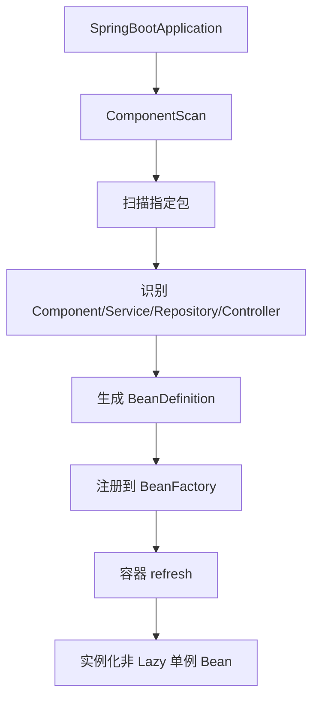
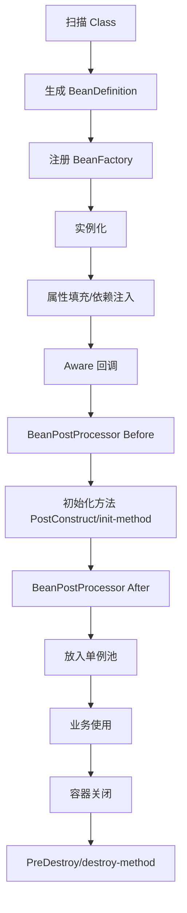

# 第六章 Spring 为什么能够管理整个系统

## 6.1 问题：没有 Spring 会怎样？

如果没有 Spring，业务代码中会直接创建依赖对象：

```java
public class DecisionService {

    private OracleDao oracleDao = new OracleDao();

    private RedisService redisService = new RedisService();

    private MQProducer mqProducer = new MQProducer();
}
```

问题：

- 业务代码和具体实现强耦合
- 底层实现变化时需要大量修改
- 单元测试不方便 mock
- 对象生命周期分散，不易治理
- 无法统一增强事务、日志、监控等能力

---

## 6.2 IOC 解决什么问题？

IOC 的本质：

> 将对象控制权从业务代码转移到 Spring 容器。

业务代码不再关心对象如何创建。

只声明：

> 我需要什么依赖。

由容器决定：

> 创建哪个对象、什么时候创建、如何注入、如何销毁。

---

## 6.3 IOC 和 DI 的关系

IOC 是思想。

DI 是实现方式。

常见依赖注入方式：

- 构造器注入
- Setter 注入
- 字段注入
- `@Autowired`
- `@Resource`

一句话：

> IOC 负责把对象交给容器管理，DI 负责把依赖注入到对象中。

---

## 6.4 Spring 如何知道哪些 Bean 要管理？

启动流程：



需要注意：

> Spring 不是扫描后直接 new 对象，而是先生成 BeanDefinition。

---

## 6.5 BeanDefinition 是什么？

BeanDefinition 是 Bean 的元数据。

包含：

- Bean 类型
- 作用域 Scope
- 是否懒加载
- 初始化方法
- 销毁方法
- 构造参数
- 依赖关系

BeanFactory 根据 BeanDefinition 创建 Bean。

---

## 6.6 Bean 什么时候创建？

### 默认情况

非 Lazy 的单例 Bean 会在容器 refresh 阶段统一创建。

核心阶段：

> preInstantiateSingletons

---

### Lazy 情况

如果标注：

```java
@Lazy
```

BeanDefinition 仍然会注册。

但 Bean 不会在启动时实例化，而是在第一次使用时创建。

---

## 6.7 Bean 生命周期

完整流程：



---

## 6.8 为什么生命周期这么复杂？

因为 Spring 需要在 Bean 的不同阶段插入扩展能力。

例如：

- 属性注入
- Aware 获取容器资源
- 初始化前后扩展
- AOP 代理创建
- 事务增强
- 销毁回调

所以生命周期不是复杂化，而是为了给框架扩展点。

---
