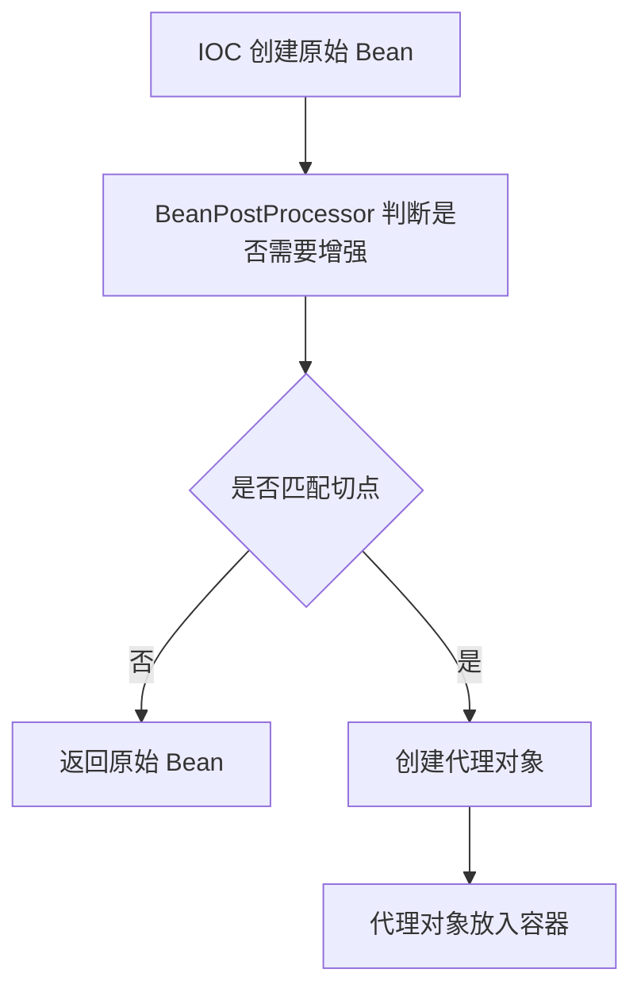
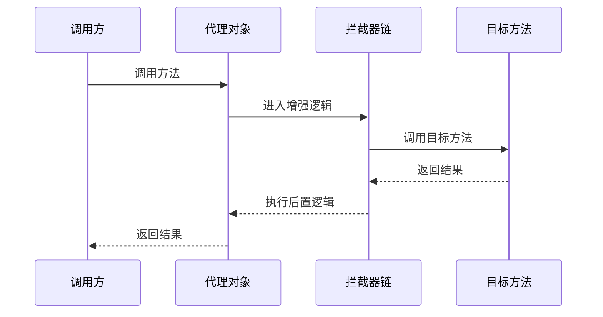
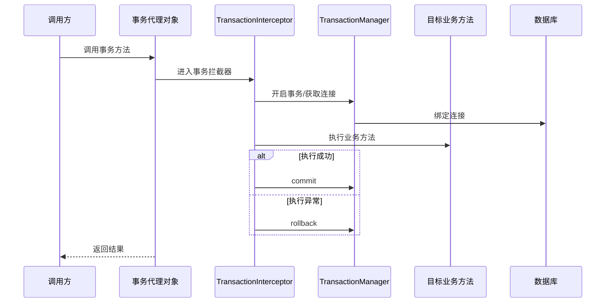

# 第七章 Spring AOP 与事务

## 7.1 为什么需要 AOP？

系统中有很多逻辑不是业务本身，但大量业务方法都需要。

例如：

- 日志
- 权限
- 事务
- 监控
- 链路追踪
- 统一异常处理

这些逻辑称为横切逻辑。

如果每个业务方法都手写，会造成重复代码。

AOP 的作用：

> 将横切逻辑从业务代码中抽离，通过代理统一增强。

---

## 7.2 AOP 和 IOC 的关系

IOC 是基础。

AOP 是在 IOC 管理 Bean 的基础上做增强。

流程：



---

## 7.3 AOP 什么时候创建代理？

通常在：

> postProcessAfterInitialization

也就是 Bean 初始化完成之后。

Spring 判断该 Bean 是否需要增强。

如果需要：

- 生成代理对象
- 代理对象替换原始 Bean 暴露给业务使用

---

## 7.4 JDK 动态代理和 CGLIB

### JDK 动态代理

特点：

- 基于接口
- 使用 `java.lang.reflect.Proxy`
- 代理的是接口方法

适用：

> 目标类实现了接口。

---

### CGLIB

特点：

- 基于继承
- 生成目标类的子类
- 通过字节码增强实现

适用：

> 目标类没有接口。

限制：

- final 类不能代理
- final 方法不能增强

---

## 7.5 AOP 调用链



---

## 7.6 @Transactional 底层原理

`@Transactional` 本质是 Spring AOP 的一个应用。

核心组件：

- TransactionInterceptor
- PlatformTransactionManager
- DataSourceTransactionManager
- TransactionStatus
- ThreadLocal

执行流程：



---

## 7.7 为什么事务需要 ThreadLocal？

事务需要保证：

> 同一个事务内使用同一个数据库连接。

Spring 通过 ThreadLocal 将数据库连接绑定到当前线程。

这样同一个线程内的多个数据库操作可以共享同一个连接和事务上下文。

---

## 7.8 常见事务失效原因

### 1. 同类方法内部调用

```java
this.update();
```

没有经过代理对象，事务不会生效。

---

### 2. private 方法

代理无法增强 private 方法。

---

### 3. final 方法

CGLIB 无法重写 final 方法。

---

### 4. 异常被吞掉

事务依赖异常触发回滚。

如果 catch 后不抛出，事务可能提交。

---

### 5. 非 RuntimeException 默认不回滚

默认只对 RuntimeException 和 Error 回滚。

可以配置：

```java
@Transactional(rollbackFor = Exception.class)
```

---
