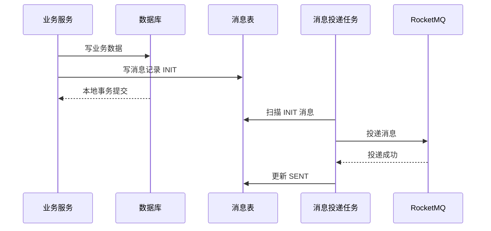
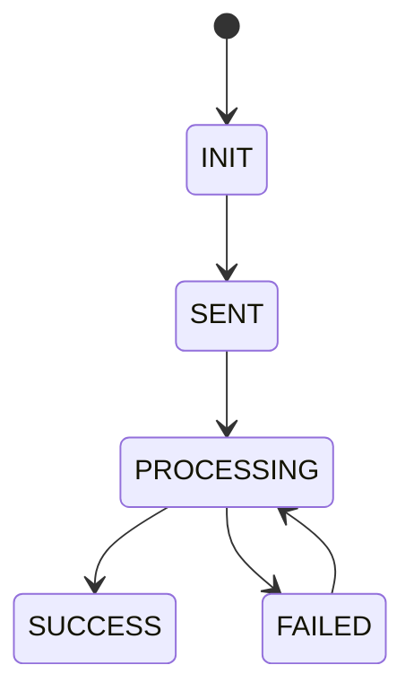
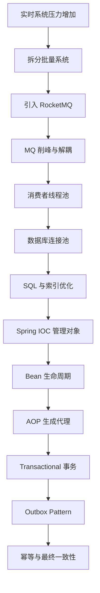

# 第八章 分布式事务与最终一致性

## 8.1 问题：为什么不能在事务方法里直接发送 MQ？

假设一个方法中：

1. 写数据库
2. 发送 MQ

可能出现几种不一致：

### 情况一：数据库成功，MQ 发送失败

业务数据已提交，但下游收不到消息。

---

### 情况二：MQ 发送成功，数据库回滚

下游收到消息，但业务数据不存在。

---

因此不能简单把 MQ 发送和数据库事务混在一起。

---

## 8.2 解决思路：本地消息表 Outbox Pattern

核心思想：

> 用本地事务保证业务数据和消息记录一起成功，再异步投递 MQ。

流程：



同一事务中写入：

- 业务表
- 消息表

保证：

> 业务成功，消息记录一定存在。  
> 业务失败，消息记录不会存在。

---

## 8.3 消息状态设计

常见状态：

```text
INIT        已创建，待发送
SENT        已投递
PROCESSING 处理中
SUCCESS     消费成功
FAILED      消费失败，待重试
```

状态机：



---

## 8.4 如果消息表写成功但 MQ 投递失败怎么办？

通过投递任务重试。

因为消息已经落库，只要系统恢复，任务可以继续扫描 INIT/FAILED 消息并重新发送。

关键点：

- 消息表要有状态字段
- 要有重试次数
- 要有下次重试时间
- 要有异常原因
- 要有唯一 eventId/requestId

---

## 8.5 消费者重复消费怎么办？

MQ 很难保证绝对不重复。

正确原则是：

> 允许重复消费，但保证重复消费结果不变。

这就是幂等。

---

## 8.6 幂等和去重的区别

### 幂等

同一操作执行多次，结果一致。

例如：

```sql
update task
set status = 'SUCCESS'
where request_id = ?
  and status != 'SUCCESS'
```

重复执行不会产生额外副作用。

---

### 去重

在业务执行前判断是否已经处理过。

例如：

- Redis SETNX
- 数据库唯一索引
- 消费日志表

---

## 8.7 幂等实现方式

### 1. 唯一业务键

使用：

- requestId
- eventId
- taskId

作为唯一标识。

数据库建立唯一索引。

---

### 2. 状态机控制

例如：

```text
INIT → PROCESSING → SUCCESS
```

只有状态允许流转时才更新。

---

### 3. Redis SETNX

```text
SETNX consume:eventId 1 EX 3600
```

成功表示首次消费。

失败表示已经处理过或处理中。

---

### 4. 数据库唯一索引

例如：

```sql
create unique index uk_event_id on consume_log(event_id);
```

重复插入会失败，避免重复处理。

---

## 8.8 最终一致性总结

分布式场景下，不一定追求强一致。

常见做法是：

- 本地事务保证业务数据和消息记录一致
- MQ 保证异步投递和削峰
- 重试保证消息最终送达
- 幂等保证重复消费安全
- 状态机保证过程可追踪

一句话：

> 用本地事务保证“可恢复”，用 MQ 保证“可异步”，用幂等保证“可重复”，最终达到一致。

---

# 当前版本学习链路总图



---

---
